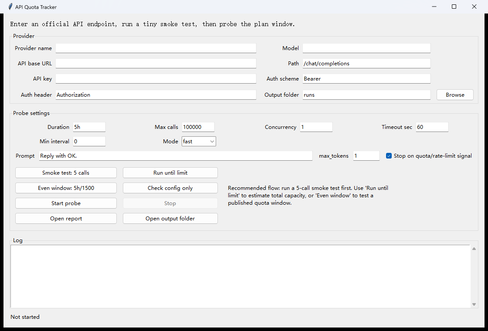

# API Quota Tracker

API Quota Tracker is a small open-source tool for measuring how many official API calls a plan allows in a time window.



It is designed for:

- OpenAI-compatible chat completion APIs
- subscription or quota window checks
- simple Windows users who want a double-click GUI
- developers who want JSON logs for later analysis

It is not designed to bypass provider limits, captchas, account restrictions, or terms of service.

## Download

- Latest release: https://github.com/yindudegugezhanghao-lgtm/api-quota-tracker/releases/latest
- Source code ZIP: https://github.com/yindudegugezhanghao-lgtm/api-quota-tracker/archive/refs/heads/main.zip

Do not put API keys into GitHub issues, screenshots, commits, or config files.

## Features

- Sends tiny chat completion requests with `max_tokens = 1` by default.
- Supports "run until limit" and "spread calls evenly over a window" modes.
- Writes `results.jsonl`, `summary.json`, `metadata.json`, and a readable `report.txt`.
- Includes a Tkinter GUI for Windows and a CLI for automation.
- Keeps API keys in environment variables and does not write them to output files.
- Includes an optional Kimi CLI probe for Kimi Code Plan-style workflows.

## Screenshots

GUI:


Sample report:


## Quick Start On Windows

1. Install Python 3.11 or newer.
2. Download this repository as a ZIP and unzip it.
3. Double-click:

```text
open_gui.bat
```

4. Fill in:

- Provider name
- API base URL
- API path, usually `/chat/completions`
- Model name
- API key

5. Click `Smoke test: 5 calls`.
6. If the smoke test works, click `Run until limit` or `Even window: 5h/1500`.

The output folder will contain a human-readable `report.txt`.

More detailed setup notes are in [docs/quickstart.md](docs/quickstart.md).

## CLI Usage

Copy the example config:

```powershell
Copy-Item config.example.toml config.toml
```

Edit `config.toml`, then set your key in the current terminal:

```powershell
$env:PROVIDER_API_KEY = Read-Host "Paste provider API key"
```

Check the config without sending calls:

```powershell
python plan_probe.py --config config.toml --dry-run
```

Run the probe:

```powershell
python plan_probe.py --config config.toml
```

## Configuration

Example:

```toml
[provider]
name = "example-openai-compatible"
base_url = "https://api.example.com/v1"
path = "/chat/completions"
model = "your-model-name"
api_key_env = "PROVIDER_API_KEY"
auth_header = "Authorization"
auth_scheme = "Bearer"

[run]
pacing = "fast"
duration = "5h"
max_calls = 100000
concurrency = 1
min_interval_seconds = 0
request_timeout_seconds = 60
output_dir = "runs"
stop_on_limit = true

[request]
prompt = "Reply with OK."
max_tokens = 1
temperature = 0

[limit_detection]
status_codes = [402, 403, 429]
body_keywords = ["rate limit", "too many requests", "quota", "insufficient", "limit exceeded"]
```

## Modes

`pacing = "fast"` sends requests as quickly as allowed by `concurrency` and `min_interval_seconds`.

Use it when you want to estimate where the plan starts rejecting calls.

`pacing = "even"` spreads `max_calls` over `duration`.

Use it when a provider advertises a fixed window such as 1500 calls per 5 hours.

## Output

Each run creates a folder like:

```text
runs/20260531-120000-provider-name/
  metadata.json
  results.jsonl
  report.txt
  summary.json
```

Read `report.txt` first. It explains:

- how many calls were submitted
- how many succeeded
- which call first looked like a limit
- whether the evidence points to auth, permission, quota, or rate limiting

See [docs/examples.md](docs/examples.md) for a fake sample report and output layout.

## Optional Kimi CLI Probe

If your plan is only available through the official Kimi CLI, use:

```text
open_kimi_cli_probe.bat
```

This helper invokes the `kimi` command directly and writes output to `kimi_cli_runs/`.

You must install and authenticate the official Kimi CLI yourself before using this helper.

## Security Notes

- Do not commit `.env`, `config.toml`, run folders, logs, or reports.
- The GUI stores form settings but intentionally does not save the API key.
- API keys are passed to the child process through environment variables.
- Public issue reports should remove provider keys, request IDs, account IDs, and private endpoint URLs.

Read [docs/security.md](docs/security.md) before publishing logs or screenshots.

## Development

This project uses only the Python standard library.

Run a syntax check:

```powershell
python -m py_compile plan_probe.py gui.py kimi_cli_probe.py
```

## License

MIT
