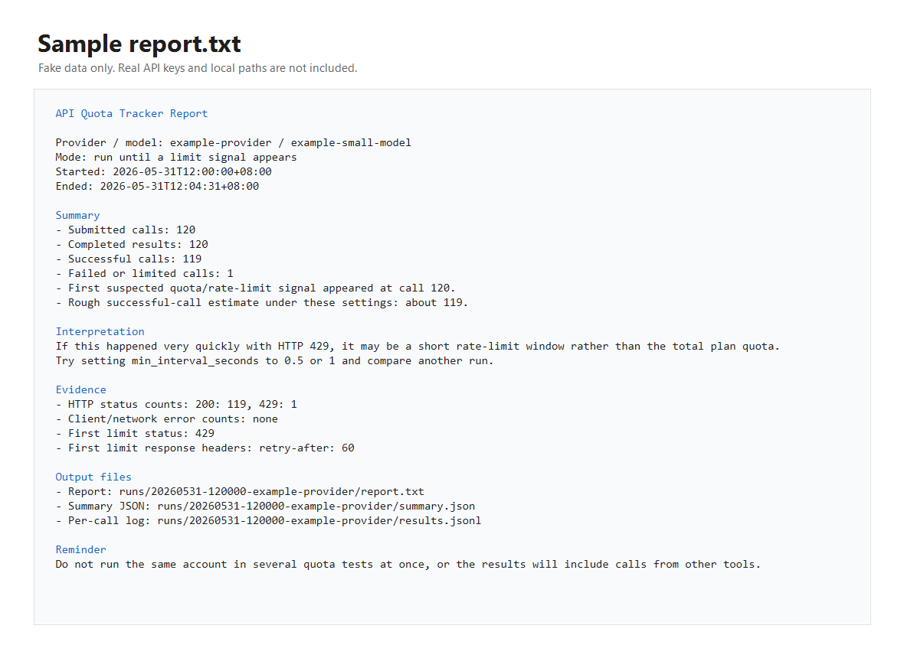

# Examples

The example files in this folder use fake data. They are safe to commit and are intended to show the shape of the output.

## Sample Report

Text version:

```text
docs/examples/sample-report.txt
```

Screenshot:



The report is the first file most users should read after a run. It summarizes:

- total submitted calls
- successful calls
- failed or limited calls
- first suspected quota or rate-limit signal
- output file locations

## Output Folder Shape

A normal run creates:

```text
runs/20260531-120000-provider-name/
  metadata.json
  results.jsonl
  report.txt
  summary.json
```

`results.jsonl` is useful for detailed analysis. `report.txt` is better for a quick read.

## Interpreting Limit Signals

A limit signal can mean different things:

- `429`: often a rate limit, quota limit, or short window throttle
- `403`: often account permission, region, policy, or quota
- `402`: often billing or balance
- body text such as `quota`, `insufficient`, or `limit exceeded`: provider-specific limit evidence

Always compare the status code, response body, and response headers before deciding what the result means.
